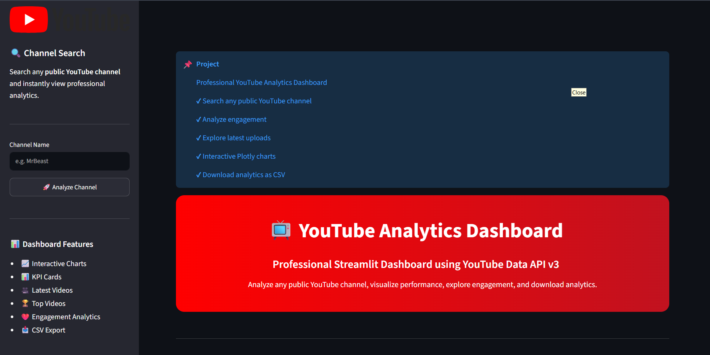
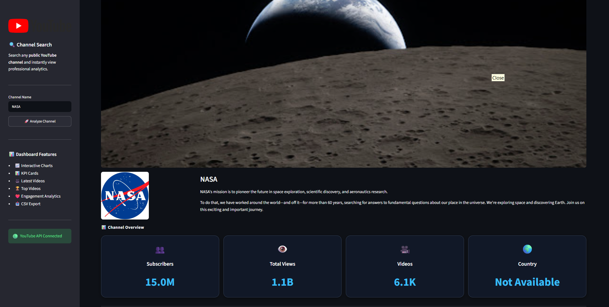
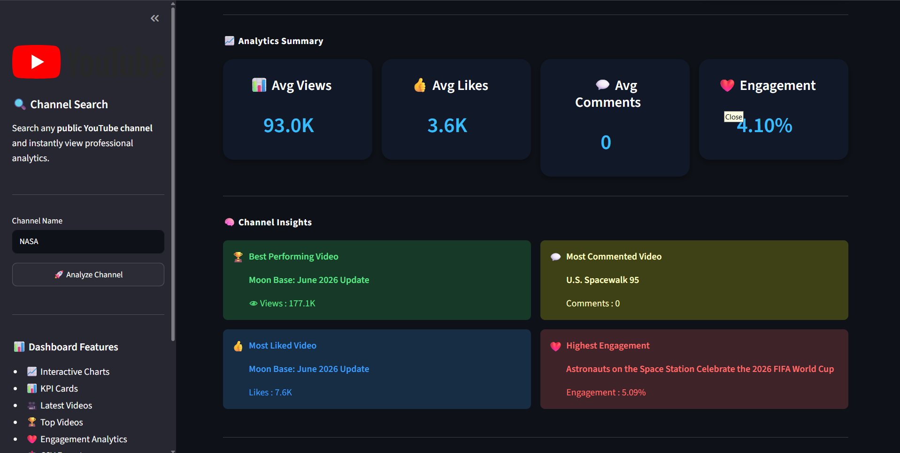
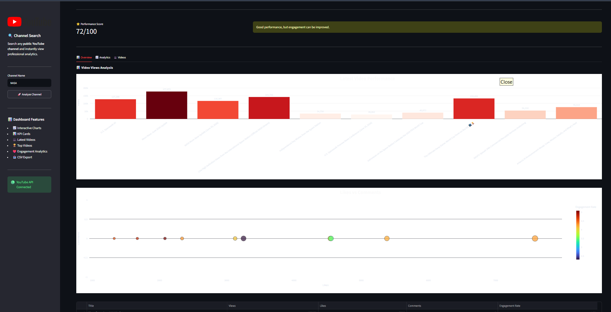

# 📺 YouTube Data Dashboard using Streamlit


---

## 📌 Project Overview

The **YouTube Data Dashboard** is a professional analytics dashboard developed using **Python** and **Streamlit**.

The application allows users to search any public YouTube channel and instantly visualize important channel statistics including subscribers, total views, total videos, engagement rate, latest uploads, interactive charts, and downloadable analytics reports.

This project was developed as the **Final Internship Project** at **Crixsoft Solutions**.

---

# 🚀 Live Demo

### 🌐 Streamlit Deployment

https://youtube-data-dashboard-app-7usmpbz3innbqkdzruesyt.streamlit.app/

---

# ✨ Features

- 🔍 Search any public YouTube channel
- 📊 Professional KPI Dashboard
- 📈 Interactive Plotly Charts
- 🎥 Latest Uploaded Videos
- 🏆 Top Performing Videos
- ❤️ Engagement Analytics
- 📄 Download CSV Reports
- ☁️ Cloud Deployment using Streamlit Community Cloud
- 📱 Responsive Dark Theme UI

---

# 🛠 Tech Stack

- Python
- Streamlit
- Pandas
- Plotly
- Google API Client
- YouTube Data API v3
- python-dotenv

---

# 📂 Project Structure

```text
YouTube-Data-Dashboard-Streamlit/
│
├── app.py
├── config.py
├── analytics.py
├── helper.py
├── youtube_api.py
├── requirements.txt
├── README.md
├── .gitignore
├── .env.example
│
├── screenshots/
│   ├── 01-home.png
│   ├── 02-channel-overview.png
│   ├── 03-analytics-summary.png
│   ├── 04-views-chart.png
│   ├── 05-latest-videos-dataset.png
│   ├── 06-latest-uploaded-videos.png
│   └── 07-footer.png
│
└── utils/
```

---

# 📷 Screenshots

## 🏠 Home Page



---

## 📊 Channel Overview



---

## 📈 Analytics Summary



---

## 📉 Interactive Charts



---

## 📄 Latest Videos Dataset


---

## 🎥 Latest Uploaded Videos


---

## 🚀 Dashboard Footer


---

# ⚙ Installation

Clone the repository

```bash
git clone https://github.com/adityakumarverma647-ai/YouTube-Data-Dashboard-Streamlit.git
```

Move inside the project

```bash
cd YouTube-Data-Dashboard-Streamlit
```

Install dependencies

```bash
pip install -r requirements.txt
```

Create a `.env` file

```env
YOUTUBE_API_KEY=YOUR_API_KEY
```

Run the application

```bash
streamlit run app.py
```

---

# 🔑 API Setup

1. Create a Google Cloud Project.
2. Enable **YouTube Data API v3**.
3. Generate an API Key.
4. Store the API key in the `.env` file or Streamlit Secrets.

---

# 📥 CSV Export

The dashboard allows users to export the latest analytics data in CSV format for further analysis.

---

# 🌍 Deployment

This project is deployed using **Streamlit Community Cloud**.

Live App:

https://youtube-data-dashboard-app-7usmpbz3innbqkdzruesyt.streamlit.app/

---

# 🚀 Future Improvements

- Channel Comparison
- Sentiment Analysis
- Trending Video Detection
- AI-based Performance Prediction
- Historical Analytics
- User Authentication

---

# 👨‍💻 Developer

**Aditya Kumar Verma**

B.Tech (Computer Science & Engineering - Artificial Intelligence)

GitHub:
https://github.com/adityakumarverma647-ai

LinkedIn:
(Add your LinkedIn Profile URL)

---

# 🙏 Acknowledgements

- Crixsoft Solutions
- Google Developers
- Streamlit
- Plotly
- Pandas
- YouTube Data API v3

---

## ⭐ If you like this project, don't forget to give it a Star!